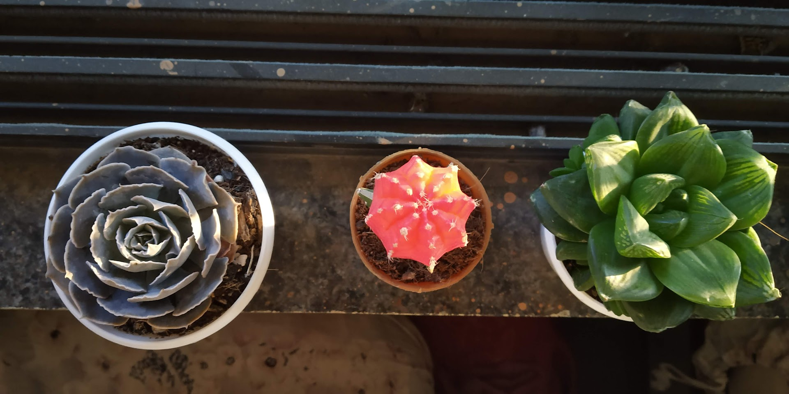
(Echeveria Elegans, Grafted moon cactus, and Haworthia Cymbiformis)

I like nature and plants in general but succulents are my favorite. However, I love cacti the most. (Cactus is subtype of succulent itself, so following applies to both mostly)

> Cactus teach you that no matter how the situation is, you keep living your life the fullest. Not just that, bloom like you are the happiest. 
>
> \- Me 😁

# Care
It doesn't need any care. You go on a vacation for a month and on return, the catus will welcome you with the same freshness. 

No water, no issue; no sunlight, no issue; too much sunlight, no issues.

# Beauty
No offence to rose lovers (I like roses too) but they are liabilities (the princess of plants). Roses are beautiful. 

But, cactuses are equaly beautiful. I admire their beauty more as it came without care!

Just look at the images of Huernia Zebrina blooms
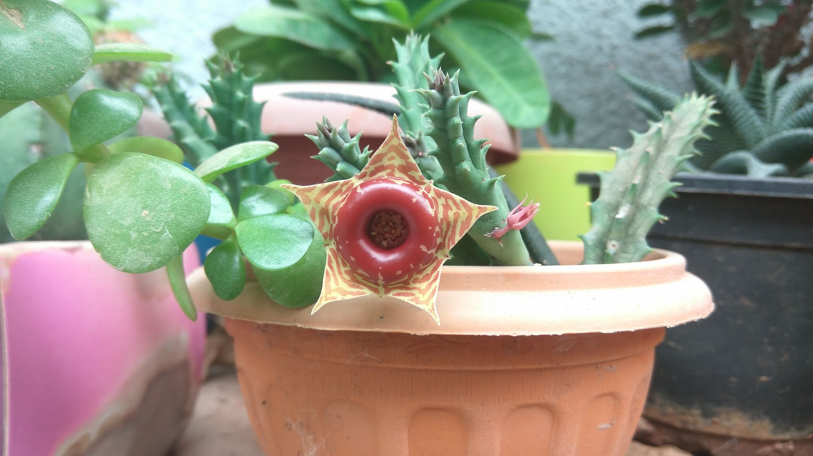
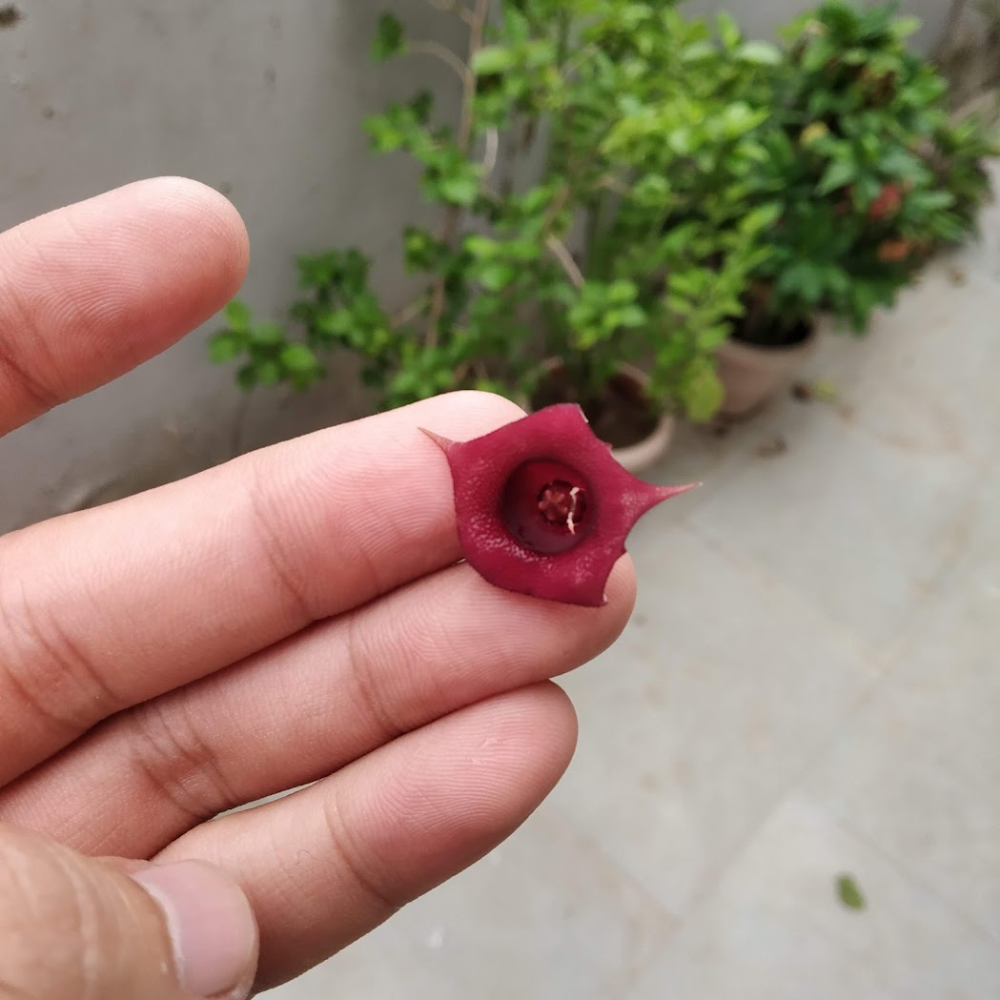

It makes my ugly shoe rack beautiful
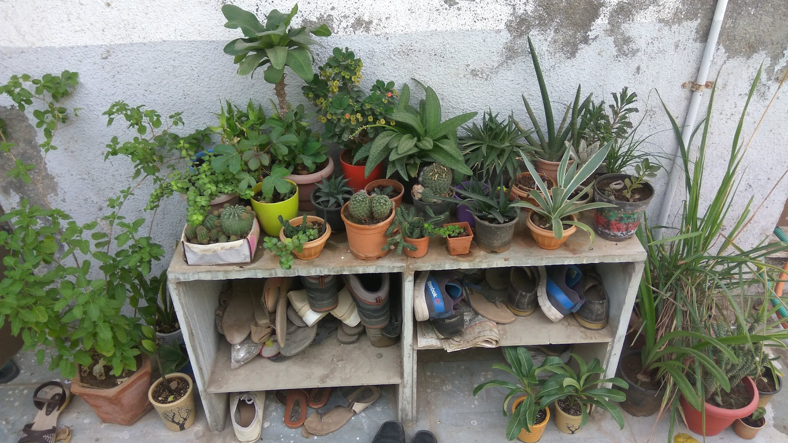

# Flower
It produces awesome flowers as seen in other photos, here are some more (Barrel cactuses, Echinocactus spp)
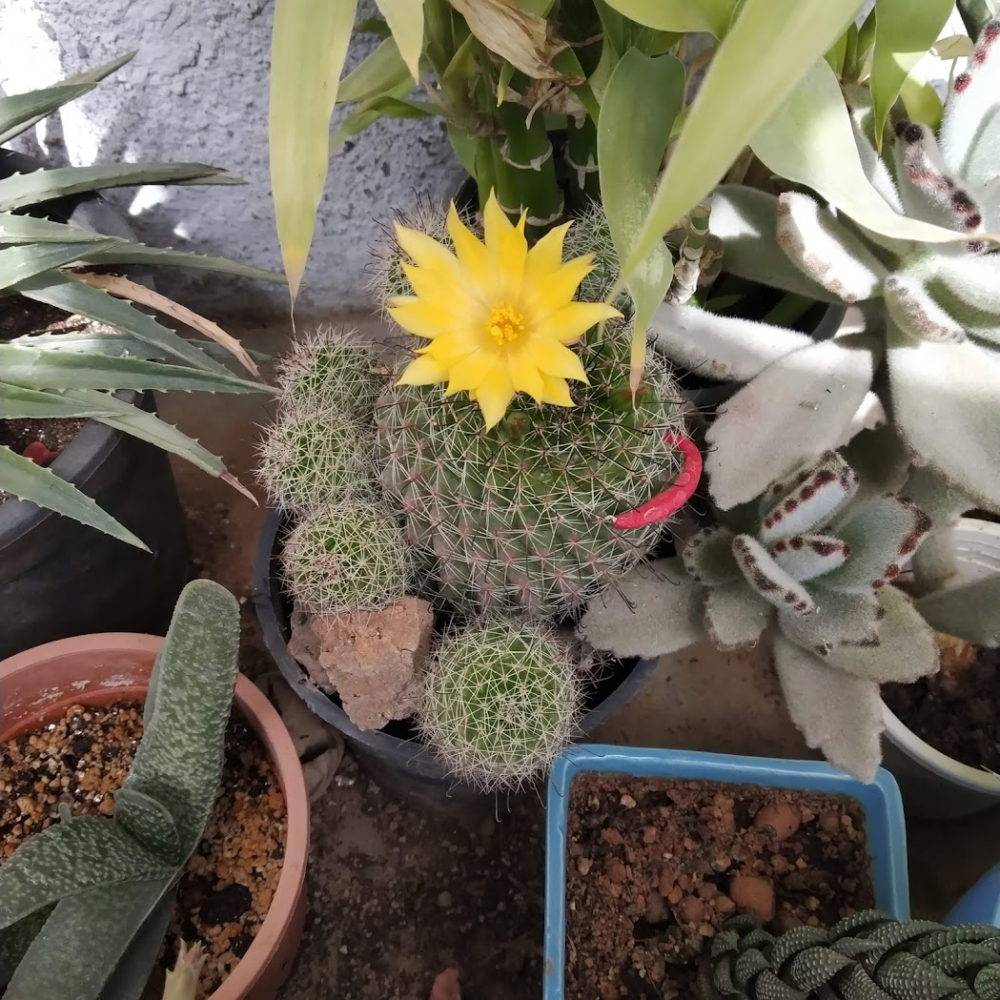
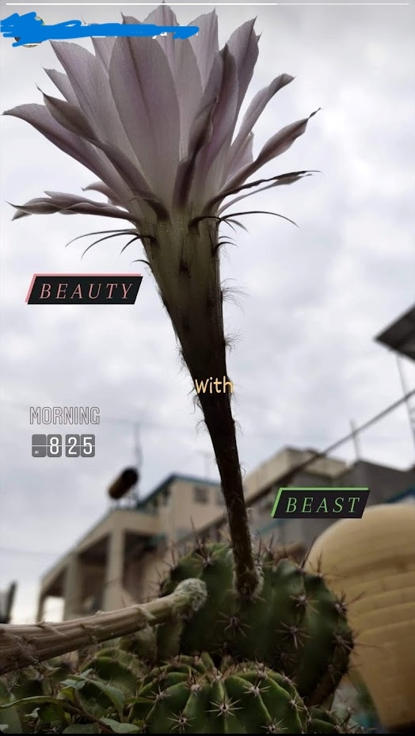

# Space
You put all of them in one pot and still they will thrive (Bunny Ears Cactus)
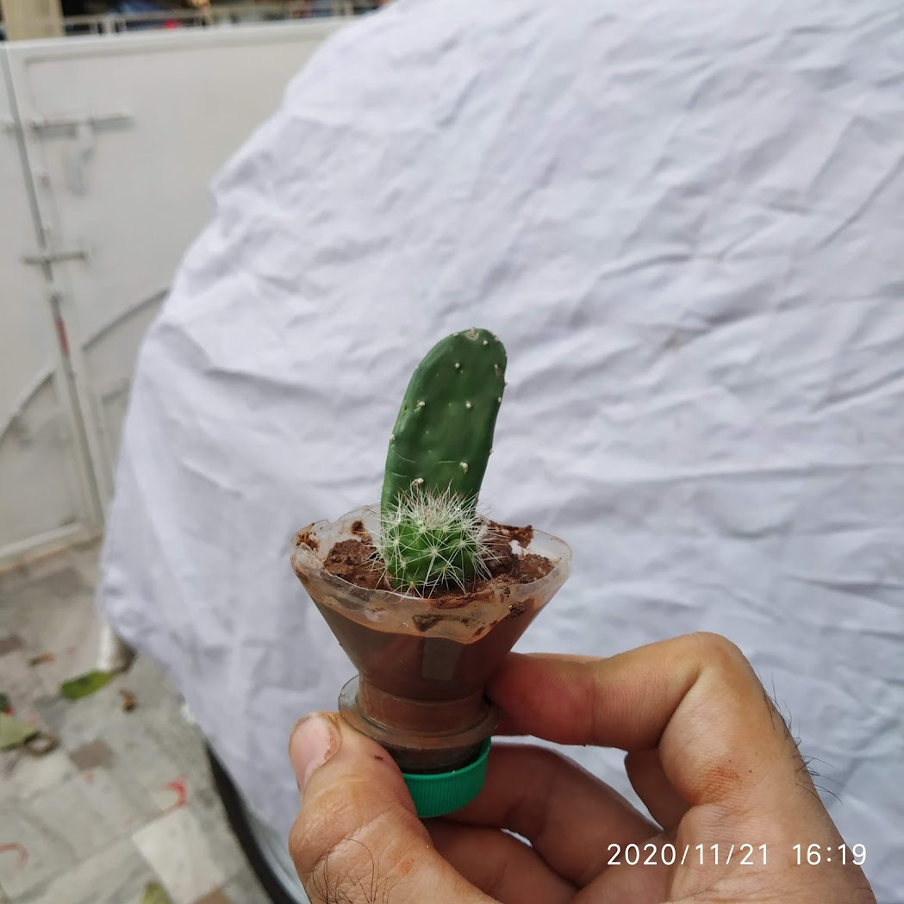
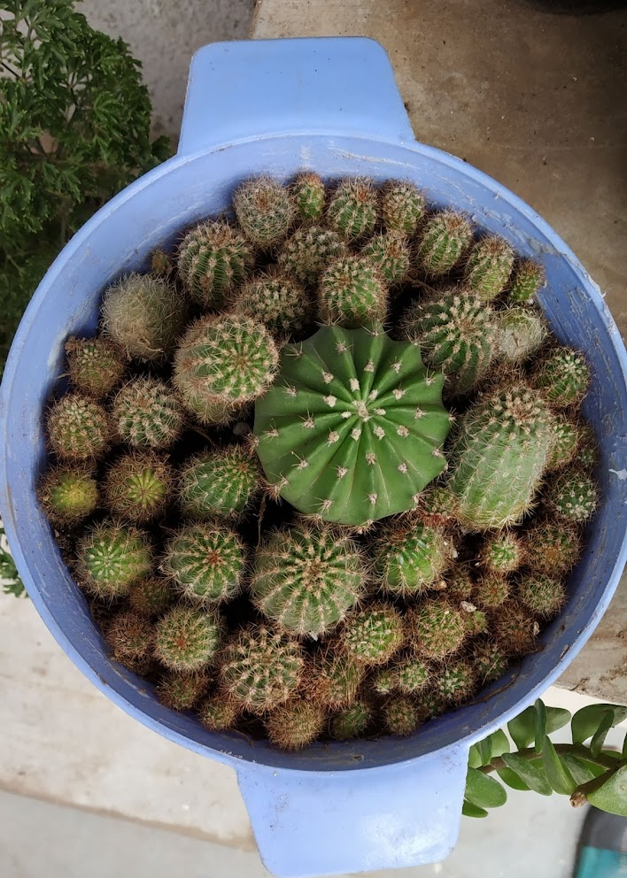

# Children
How it started
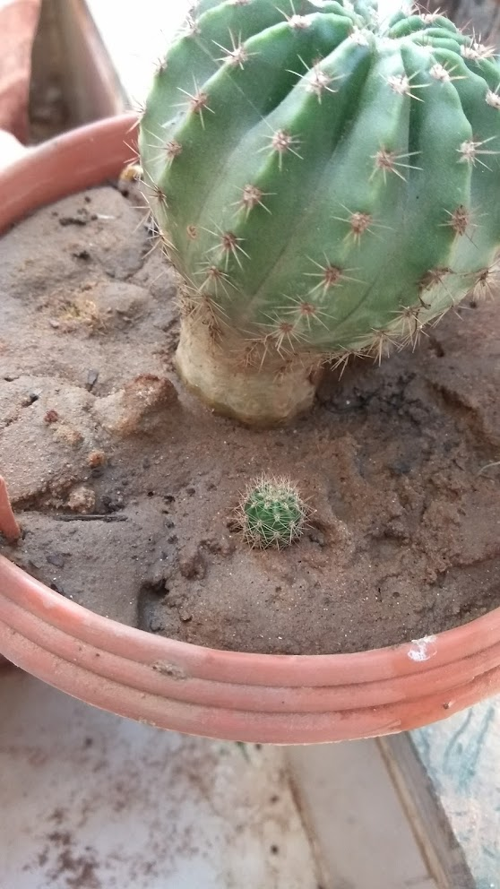

and how it is going
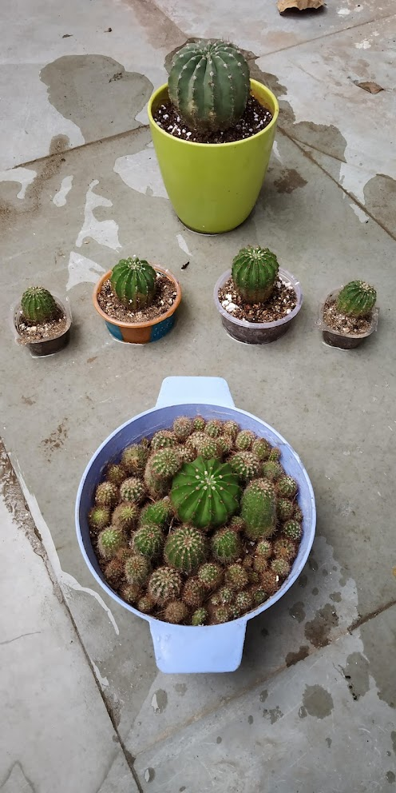

Every leaves of these plants can be potentially a plant. Name the plant is literally "mother of thousands"
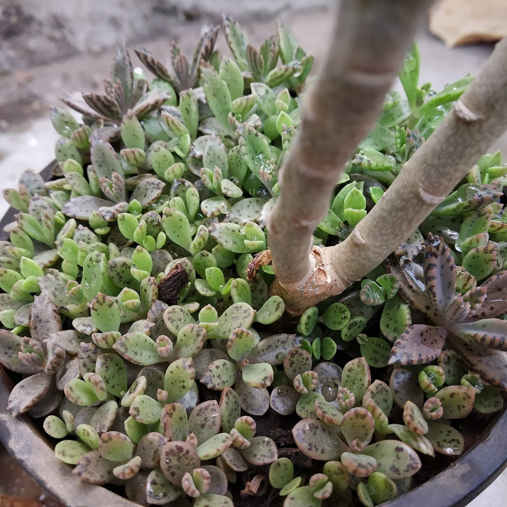

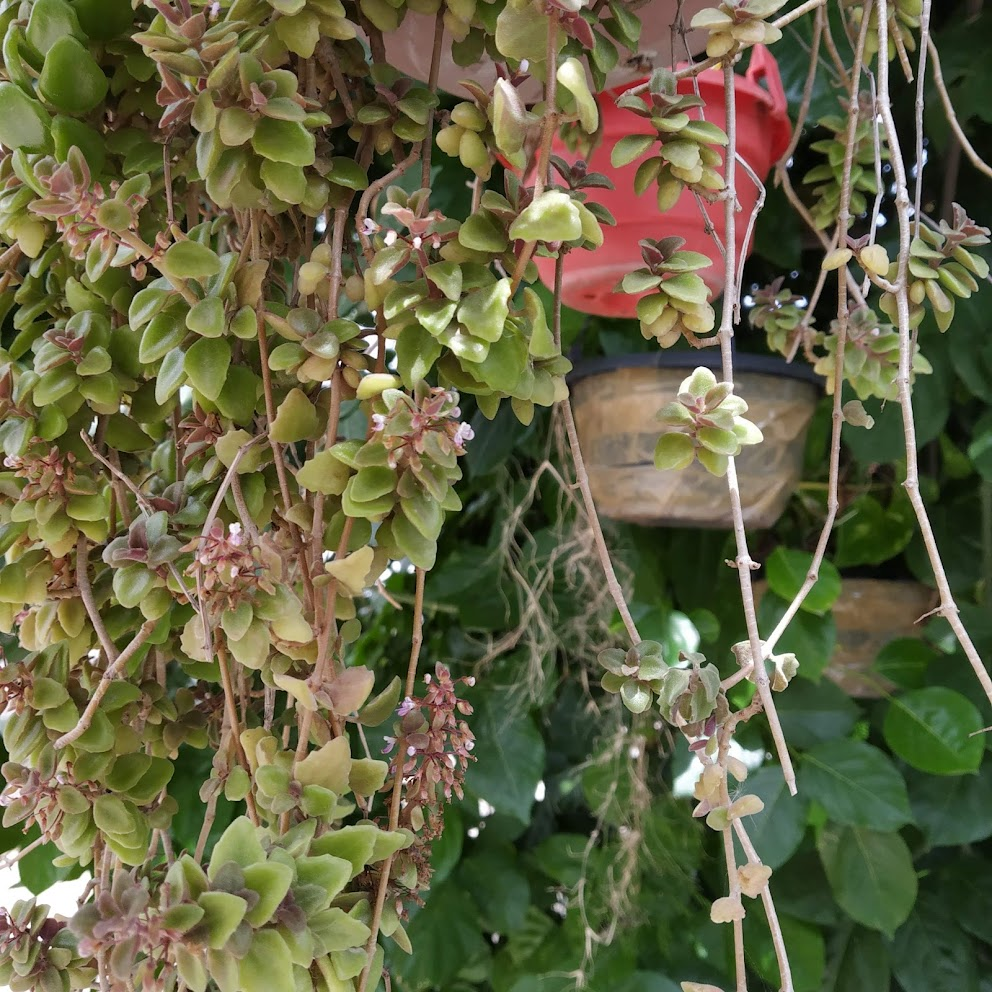

# Shape
It can take wierd (argubly beatiful) shape without any special treatment

Floowing two photos are the same plant (the first one is child of the second one) (Echinopsis oxygona - Easter Lily Cactus)
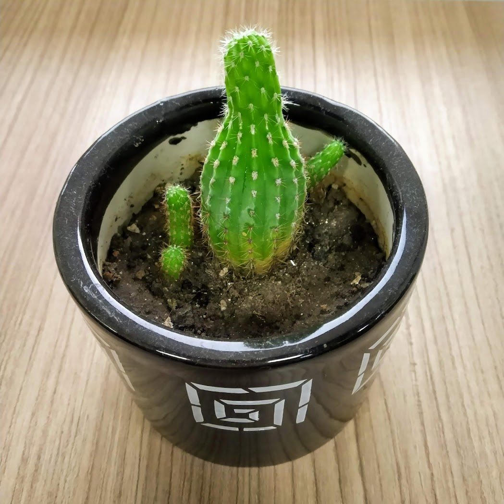
This(above) plant enhanced office desk for many months

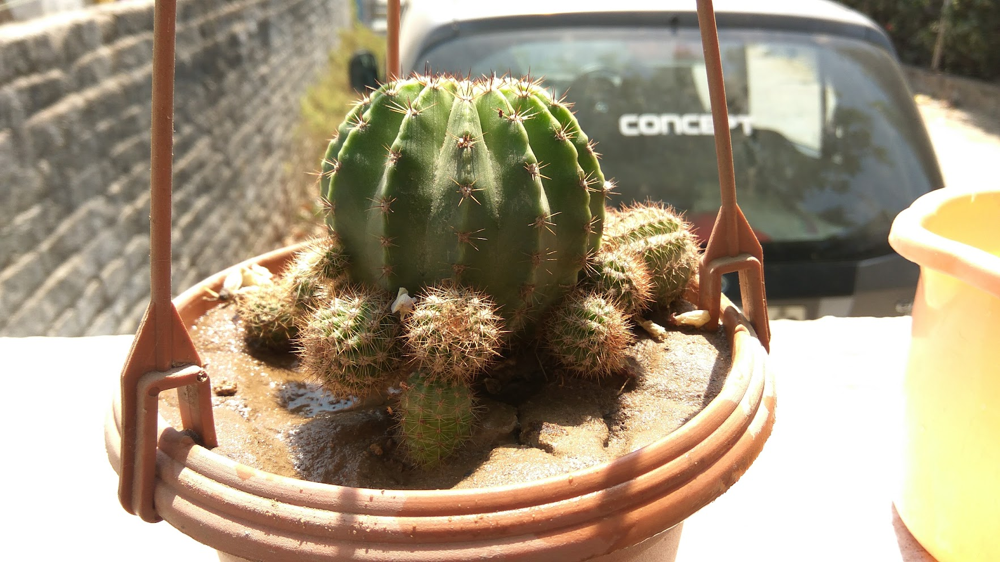

# Image credit
Me me me. Everything is from my garden. I have many more I could not put in the post. 

It feels like I need to use proper camera from next time!