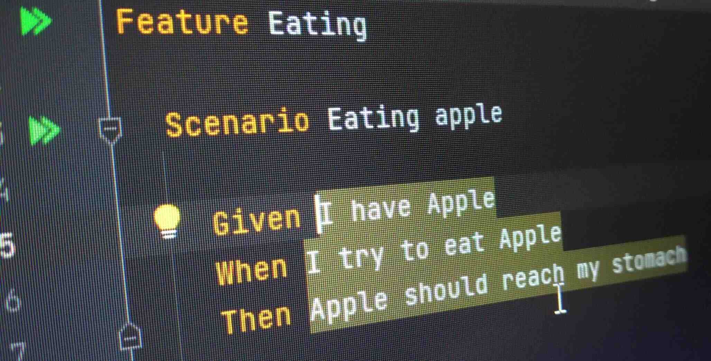

#### Background
I come from a callow project.

We didn't have tests, no package manager, no build tools, no CI/CD pipelines.

We used to manually build from eclipse, copy war files.

We used to manually execute SQL changes with every release.  

#### A chance
My then project manager came and asked me that "Should we start writing automated tests?".

I being naive, said **NO**.

### Reason
Whenver I see videos and articles about unit testing. I see following example. 

```java
@RequestMapping("/happy")
public class HappyBirthdayController() {
    @GetMapping("/birthday")
    public String sayHappyBirthday() {
        return happyBirthdayService.sayHappyBirthday();
    }
}
```
Test case
```java
public class HappyBirthdayControllerUnitTest() {
    HappyBirthdayController controller;
    @BeforeEach
    void setup() {
        HappyBirthdayService service = mock(HappyBirthdayService)
        controller = new HappyBirthdayController();
    }
    void testThatHappyBirthdayIsCallingService() {
        controller.sayHappyBirthday();
        verify(service).sayHappyBirthday();
    }
}
```
The same way, every example mocks databases. That was the biggest issue for me. 

We are not developing algorithms, we are developing APIs, which need to interact with databases.

If you are mocking the database then you are losing out a big chunk of logic from testability perspective. 

_Reason 2_
If you ask a developer to add test cases to existing API then (s)he will write some junk code and name that a test case. Nobody tests the tests!

It is possible that dev missed a few cases. Don't get me started on code coverage; that measure is useless to some extent. 


#### The way I used to work
Let's say I needed to create one API that `says happy birthday`.

The first step, I create API spec. Create postman sample and execute it before writing any code. Just to make sure no one has created that API. 

Then I would write a controller and make sure that API is not giving `404` now but throwing `500`, just to make sure controller is working properly.

Then I wire service and repository classes and execute the API. It should throw SQL error, not java code error. 

Then I would create DB and execute the API from postman again. 

_Case 2_
When I have to fix a bug, the first thing I do is to make sure I can reproduce the issue. 

_Case 3_
There were some scenarios where I had doubts about APIs, APIs were working and providing `OK` but I didn't have confidence, So I used to comment out one of the logical steps and make sure the API fails. 

### Introduction
We obviously had multiple issues. 

Our engineering head came to me and asked me to check out BDD (Behavior Driven Development). I tried that out and liked (not loved right away but liked)

The idea is to write test cases first. Failing test case. That clicked me. It solved my biggest issue **now you are testing your tests cases too**.

I stumbled upon [test containers](https://www.testcontainers.org/); the idea is to use docker to start actual DB and connect to that in tests. It solved my another challenge to **test database**

I loved the idea. 

### Adaptation
When I looked back, it seems that I was following TDD all along. It's just that I never **Automated** my steps. 

I saw [choonkeat](https://github.com/choonkeat)'s TDD [video](#tddfor-those-who-dont-need-it) in a Go conf. I loved it. It is a must watch. That made sense to me. I am a getting things done guy (with code quality an integral part though). 

The biggest thing is **it gives you steps to follow to complete your work**. It is now not additional time to write your tests but you are creating **tests as part of development** and creating **regression test suite** along the way. That gives me **confidence to refactor** my code

It helps me take baby steps. As I first write API integration test, then I write controller test to solve first error then I write service tests to write the second error and then I write liquibase DB migration changesets to solve the SQL error. 

Eventually, I created one TDD [video](#unit-testing-in-angular-tdd-screencast). Not to be helpful to others but just to practice and learn.  

### TDD rules - takeaways
If you don't read anything from this post, just make sure you do the following two things
* **Make sure you have a failing test first**
* **Don't write any code before you have a failing test**

### Issues
The example I mentioned above still ended up in our test suite. I think having that type of test cases are **silly**. 

Most TDD folks don't agree with me. The problems with that type of test case are
* It does not test anything
* There is no way that type of test case can fail alone. There will always be one API integration test failing along with that. 
* It takes additional time to test
* It is noise - when you have to change your structure, you have to change this test case as well
* Most important: You are testing your _structure_ while you should only be testing your _behaviour_

In my (controversial) opinion, _delete the mocking testcases_. _I hate mocking_.

### Mocking
It might sound harsh but I really hate mocking. 

Okay, mocking is useful when there are several cases you cannot cover in integration tests. 

Example: When I search from a list, it should filter based on starts with, case insensitive, avoid special chars, search multiple words, etc. 

So in this case, it is wise to create one integration test which takes one of these scenarios and provide result. Then create multiple unit test cases to cover all the scenarios. 

But when you are writing a CRUD operation - where only scenario is to store value in DB and read from it, mocking testcases don't help but become noise. 

So thumb rule - keep unit test only when the cases are not covered by integration tests or it is not practical to write so many integration tests.  

##### TDDfor those who dont need it


##### Unit testing in angular. TDD screencast.
