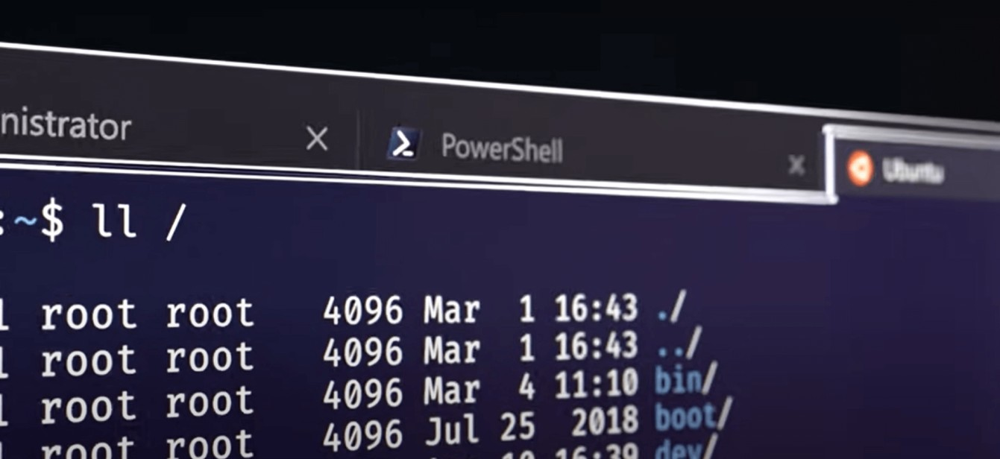

A few months ago I switched to Windows. The biggest thing I missed - ZSH and [Oh My Zsh](https://ohmyz.sh/).

Working with windows cmd or Powershell is just pathetic. You try to execute `ls` command and turned out, it is not supported.

### What do I need from a command prompt?
Following are all the capabilities from a shell/prompt/terminal

1. Tabs (I used Tilix in Ubuntu/PopOs)
2. Bit of Jazz (Colors, Icons, Emojis) (OhMyZ suffice this and following all things)
3. Information about current dir (Example, using git plugin, shell shows current branch, number of commits to push, etc)
4. Autocompletion (Folder structure)
5. **Autocompletion** (Commands based on history) (*This is most important for me*)
6. Familiarity (It should support relatively same commands. Example `ls`)
7. Interaction with other tools (Like opening VSCode, editing file, installing softwares)

### Windows alternative
After installing a few components, the shell in windows became so powerful that I don't desire to switch back to linux. 

Turned out, the only thing I missed about linux is its terminal capability.

Which alternatives in windows solved all issues

1. Tabs ([Windows Terminal](https://aka.ms/terminal))
2. Jazz ([Starship](https://starship.rs/), [Nerd Fonts](https://www.nerdfonts.com/))
3. Plugin (Starship Plugins)
4. Autocompletion ([Powershell 7](https://github.com/PowerShell/PowerShell) native feature)
5. Autocompletion (Commands based on history - Powershell 7 native feature)
6. Familiarity (Powershell 7 supports many such commands; `ls`, `curl` are two examples)
7. Interaction (Powershell 7, [chocolatey](https://chocolatey.org/install))

### Steps to install

#### Powershell 7
Follow [this](https://github.com/PowerShell/PowerShell) link and from the releases page, download `.msi` and double click install.

#### Nerd Fonts
It powers all the Jazz for terminal like showing icons, emojis, and ligatures. Follow [this](https://www.nerdfonts.com/font-downloads) link and download any font you like. Fira Code is the most popular. Install after downloading. 

#### Windows Terminal
Follow [this](https://aka.ms/terminal) link. It will open a web page that will redirect to Windows store. Install from Windows store.

Set default profile to Powershell 7: Open Windows terminal 🡪 Open settings (That down arrow in the top bar) 🡪 Set Default Profile as "Powershell" (the black icon one, not the blue "Windows Powershell")

Set Fonts: Settings 🡪 Profiles (left menu) 🡪 Powershell 🡪 Appearance 🡪 Font face 🡪 Select the installed Nerd font. You can change the color scheme too, Solarized Dard was my favorite one time. 

#### Chocolatey
This step is optional but it will help installing software from terminal easily. 

Install [chocolatey](https://chocolatey.org/install) from the link. 

Usage 🡪 `choco install jre8`

#### Starship
Before installing Starship, I tried [Oh My Posh](https://ohmyposh.dev/). It was good, it can totally emulate Oh My Zsh. However, I found Starship more elegant.

The best way to install Starship is using [chocolatey](https://chocolatey.org/install). Or follow [starship](https://starship.rs) docs and install via some other way.
```
choco install starship
```

Create or Open profile file.
```
code $PROFILE 
// OR if VS Code is not installed
notepad $PROFILE 
```
This will create a file named `Microsoft.PowerShell_profile.ps1` in your Users 🡪 < User > 🡪 Documents 🡪 Powershell directory. This file is the same as `.zshrc` or `.bashrc` file. You can provide initial commands, aliases, etc.

Set Starship as the default shell. Put this inside the profile file so that every time you open the terminal, it loads Starship.
```
Invoke-Expression (&starship init powershell)
```

[Customize](https://starship.rs/config/#prompt) (Add Jazz) to Starship. However, I won't recommend doing this right away. First, setup everything and start using it all and then come back to this and tweak however you like.

#### Autocompletion
Put the following lines in your profile file and you are done
```
Set-PSReadlineKeyHandler -Key Tab -Function MenuComplete

Set-PSReadlineKeyHandler -Key UpArrow -Function HistorySearchBackward
Set-PSReadlineKeyHandler -Key DownArrow -Function HistorySearchForward
```

Controversial opinion, after using this for some time, I found this autocompletion better than what we had in ZSH. 

If you want to execute commands from history then type a few characters from command the hit `⬆️` it will show all the commands from history. 
For example, if you type `docker` + `⬆️` then it will show `docker build .` (in case you executed that in history)

The best thing, using `tab` you can have auto suggest for the commands you never executed. Like if I type `git` and `tab`, it will show `git fetch`, `git pull`, basically all the possible commands I can execute using git. (Update, I might have installed `posh git` and that might be doing it)

#### Alias
If you want to set up an alias then open the profile file and set alias like
```
Set-Alias k kubectl;
Set-Alias ka getAllKubernetes;


function getAllKubernetes(){
  kubectl get po,no,svc,ing --all-namespaces;
  kubectl get cm,secret -n app
}
```

#### Env variable
This is not directly related but this comes a lot. It is easy to set env variable in Linux. `export ENV_A="ABC"`. Also all the setup guideline of any software assume that you are on Linux and will provide the `export` based command in the example. 

However powershell has different syntaxt; Use following syntax if you want to set any environment variable.
```
$env:MY_ENV_VARIABLE = "VALUE" // to set
$env:MY_ENV_VARIABLE // to print/get
```

#### Back Search
`Cltr + r` will do the back search the same as Linux terminal

#### Linux inside windows
You can still enable `wsl 2` inside windows and make use of all the features of Windows terminal and still can use Linux under the hood. It is a different topic and requires its own post.