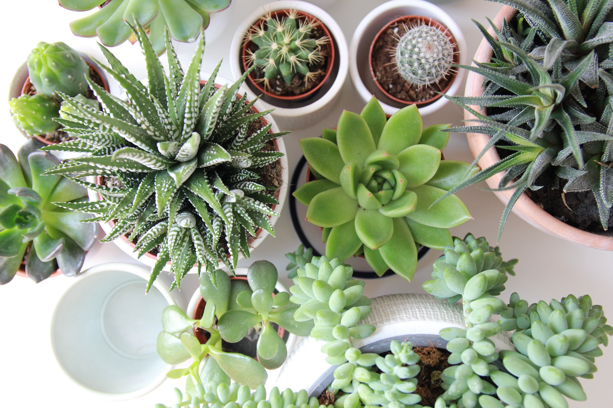

People usually think that a plant is a liability, so here is a guide, So that you don't feel too much responsibility about caring your succulent and cactus. 

## Plant Type
The one I gave you is called haworthia cymbiformis, it is an exotic plant for India. Commonly we can call it Succulent. 

It is native to Africa.

## Care
The only thing you need to remember is do not over water. That’s it.

Succulent literally means very juicy. So the plant stores water in leaf so it does not need too much water. It absorbs water whenever get change – when we water or it takes water from the fog, etc.

Water this only when you feel that the soil is dry. Even if you forget to water when soil is dry, no issue. The plants won’t mind.

It doesn’t need more sunlight. Little shade will be okay. If the plants are placed in dark corner, then an hour or two in partial sunlight will be helpful. It is okay if the plants get artificial light in form of office ceiling light or CFL or LED or partial light near window of home.

The only way you can kill this plant is to overwater them. As these are desert plants, the roots may rot if they sit too much in water. 

If you ever feel need of add soil to the pot, You can use regular garden soil, too. Keep an eye on watering as garden soil absorbs more water and does retain them. What I have used in this pot is mix of vermiculite, perlite and coco peat – this is ideal for succulents and called “succulent mix”. It will be ideal replacement for soil but can be little bit costly. It makes room for air circulation and doesn’t retain too much of water.

You don’t need to take care of fertilizers as I have already added. This plants need fertilizer only once a year. Even if you don’t put any fertilizer, that’s okay. Simple fertilizer from any nursery will do if needed.

### Credit
Photo by [Angèle Kamp](https://unsplash.com/@angelekamp?utm_source=unsplash&utm_medium=referral&utm_content=creditCopyText) on [Unsplash](https://unsplash.com/photos/OSRpN1D52EM?utm_source=unsplash&utm_medium=referral&utm_content=creditShareLink)